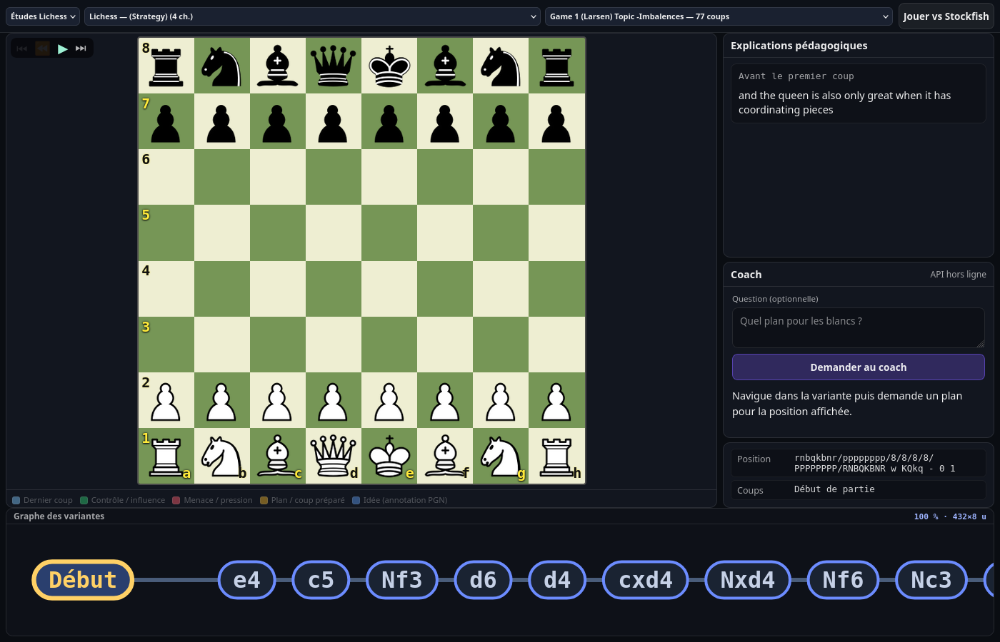
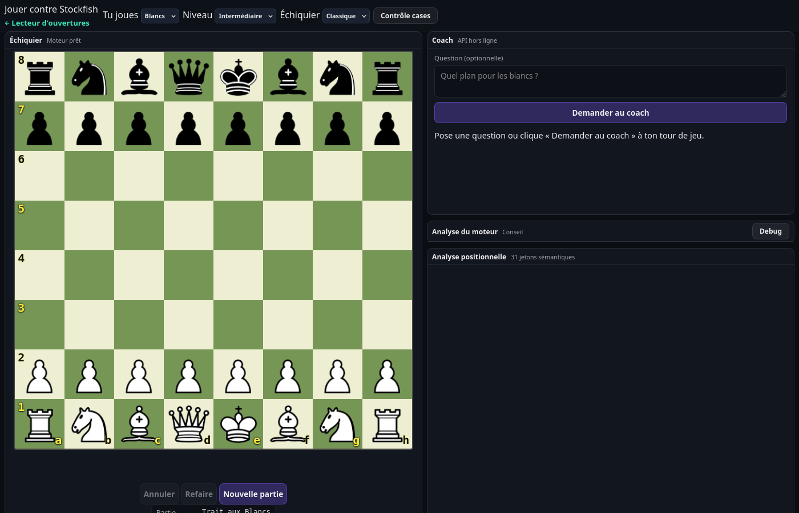
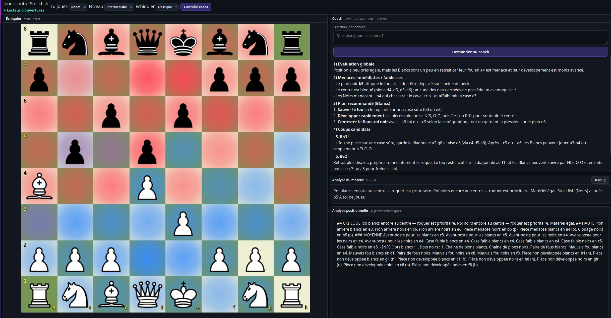

# Lecteur d'Ouvertures & Coach Échecs

Application web d'étude et de pratique des échecs — entièrement en JavaScript vanilla, sans bundler, servie par nginx dans un conteneur Podman.

---

## Deux modes

### Lecteur d'ouvertures (`/`)

Parcourez des études PGN avec commentaires, flèches pédagogiques et graphe de variantes interactif. Un coach IA répond en temps réel à vos questions sur la position.



### Jouer contre Stockfish (`/play.html`)

Affrontez le moteur Stockfish NNUE 16. Choisissez votre couleur et le niveau de difficulté. Un panneau latéral affiche l'analyse du moteur, une analyse positionnelle règle par règle et le même coach IA.



---

## Démarrage rapide

```bash
# 1. Récupérer les données PGN (obligatoire au premier lancement)
bash scripts/collect-pgn.sh

# 2. Démarrer l'application (Podman)
make dev
# → http://localhost:6400/          Lecteur d'ouvertures
# → http://localhost:6400/play.html Jouer contre Stockfish

# Arrêter
make stop
```

> **Prérequis** : Podman + podman-compose (ou Docker Compose).  
> Le conteneur embarque Stockfish WASM et sert les fichiers via nginx.  
> En développement, les fichiers JS/HTML sont montés en volume — un simple `Ctrl+Shift+R` suffit pour recharger.

---

## Fonctionnalités

### Lecteur d'ouvertures
- Lecture de fichiers PGN avec variantes arborescentes
- Graphe SVG des variantes (style git-graph) : pan/zoom, survol pour aperçu, clic pour naviguer
- Flèches et surlignages extraits des annotations PGN (`[%cal]`, `[%csl]`)
- Coach IA (streaming) : posez une question sur la position courante, réponse en prose française

### Jouer contre Stockfish
- Glisser-déposer des pièces, validation des coups via `chess.js`
- Sélection de la couleur et du niveau (Stockfish multipv)
- Analyse du moteur : meilleur coup, score, variante principale
- **Analyse positionnelle** : 31 jetons sémantiques couvrant structure de pions, cases ouvertes, avant-postes, sécurité du roi, activité des pièces, développement, espace
- Coach IA : posez une question à votre tour, réponse contextualisée à la position et aux coups joués
- Annuler / Refaire, Nouvelle partie

#### Visualisation combinée : heatmap + coach + analyse positionnelle



Le bouton **Contrôle cases** superpose une heatmap sur le plateau : chaque case est colorée selon le rapport de force entre les deux camps (rouge → contrôle blanc, bleu → contrôle noir, intensité proportionnelle à l'écart). C'est un outil visuel immédiat pour repérer les cases faibles et les zones de tension.

Le panneau **Coach** envoie la position (FEN), la couleur, l'historique des coups et votre question à un grand modèle de langage (Groq · GPT-OSS 120B). La réponse arrive en streaming et couvre : évaluation globale, menaces immédiates, plan recommandé, coups candidats et pièges à éviter.

L'**Analyse positionnelle** est produite par un moteur expert maison (répertoire `positional/`) sans LLM : chaque module inspecte un aspect spécifique de la position (structure de pions, sécurité du roi, avant-postes, colonnes ouvertes, activité des pièces…) et émet des jetons sémantiques prioritaires. L'interpréteur les convertit ensuite en conseils en prose française, triés par importance (critique → neutre).

---

## Architecture

```
index.html / app.js       ← Lecteur d'ouvertures
play.html  / play.js      ← Jouer contre Stockfish

board-view.js             ← Rendu plateau (lecteur) — SVG, flèches, highlights
play-board.js             ← Rendu plateau (jeu) — drag-and-drop, heatmap
fen-board-renderer.js     ← Helpers FEN → cases (partagé)

stockfish-client.js       ← Web Worker Stockfish NNUE 16, une analyse à la fois
positional/               ← Moteur règle-par-règle (FEN → PositionalToken[])
  index.js                ←   point d'entrée buildAllFacts()
  interpreter.js          ←   tokens → prose française (topAdvice())
  tokens.js               ←   type PositionalToken + helpers
  pawn-structure.js       ←   structure de pions
  king-safety.js          ←   sécurité du roi
  outposts.js             ←   avant-postes
  open-files.js           ←   colonnes ouvertes/semi-ouvertes
  minor-pieces.js         ←   fous et cavaliers
  … (material, development, space, piece-attacks)

eval-fr.js                ← Pont UCI → SAN chess.js → conseil français
mentor-client.js          ← Appels streaming vers l'API coach (Groq / GPT-OSS)
mentor-ui.js              ← Panneau coach : état bouton, abort, rendu markdown
pgn-graph.js              ← Graphe SVG de variantes (lane graph)
```

**Bibliothèques** (pas de bundler — imports ESM directs) :
| Lib | Usage |
|-----|-------|
| `@jackstenglein/chess` (CDN) | Arbres PGN + variantes (lecteur) |
| `chess.js` (`/vendor/`) | Validation des coups (jeu) |
| Stockfish NNUE 16 (`/vendor/`) | Moteur d'analyse (Web Worker) |

---

## Tests

```bash
npm test                                    # tous les tests
npm run test:pawn                           # structure de pions uniquement
node --test tests/king-safety.test.js       # un seul fichier
```

Tests unitaires Node (`node:test` + `node:assert/strict`).  
Chaque fichier dans `tests/` cible un module positional : FEN en entrée → assertions sur les `PositionalToken` produits.

```bash
# Vérifications navigateur (Playwright, Chromium headless)
make check           # headless
make check-headed    # navigateur visible
```

---

## Pipeline de données PGN

```bash
bash scripts/collect-pgn.sh
```

Récupère des fichiers PGN depuis Lichess (API) et le répertoire local, génère `data/pgn/catalog.json`.  
Le catalogue supporte deux modes : `openings` (liste plate) et `studies` (études Lichess avec chapitres).

---

## Coach IA

Le coach POSTe `{ fen, side, moves, question }` vers `/api/chess/mentor/groq`.  
L'URL de l'API est détectée automatiquement :
1. `window.CHESS_MENTOR_API` (variable globale)
2. `window.location.origin`
3. `http://127.0.0.1:8000` (fallback développement)

---

## Reconstruire l'image Docker

Nécessaire uniquement si `docker/web/package.json` ou le `Dockerfile` changent :

```bash
make build-web
```
