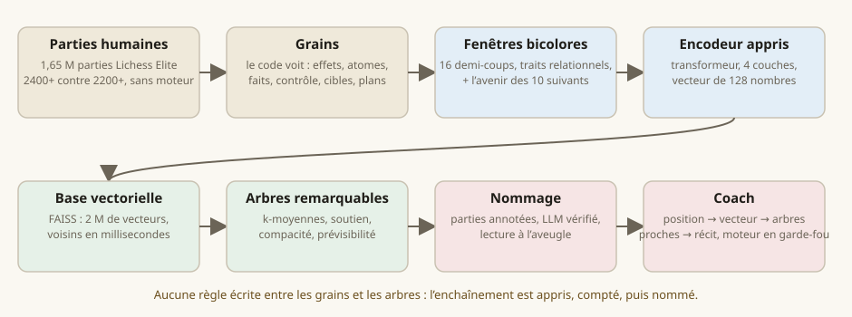
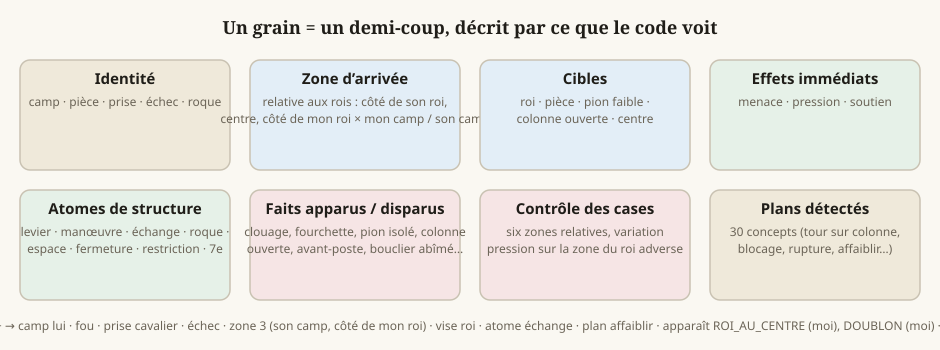
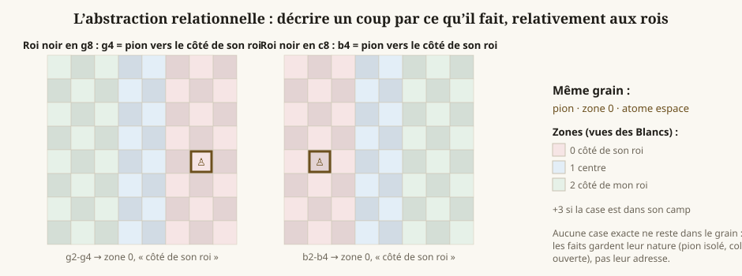
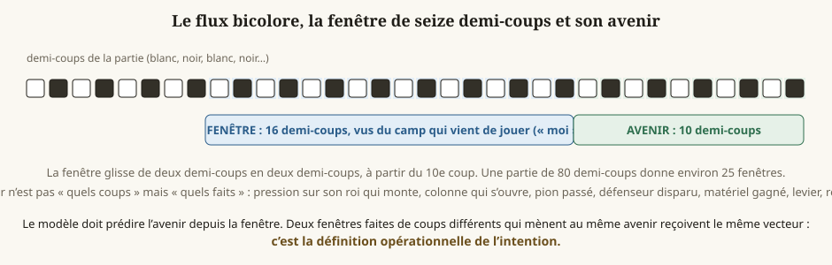
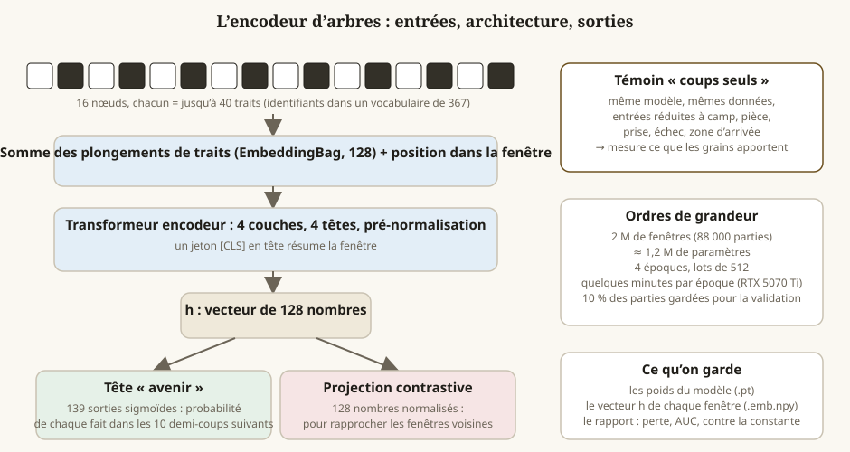
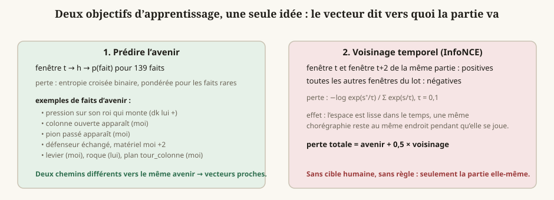
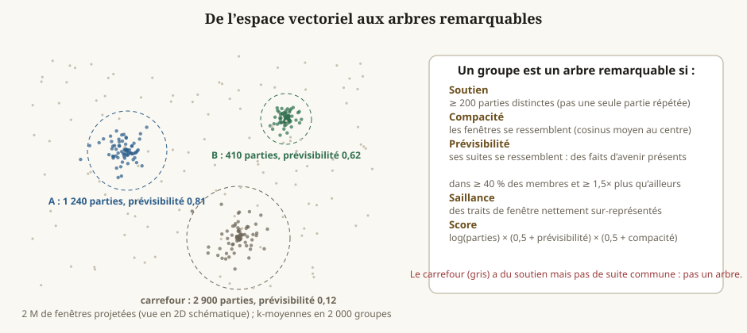
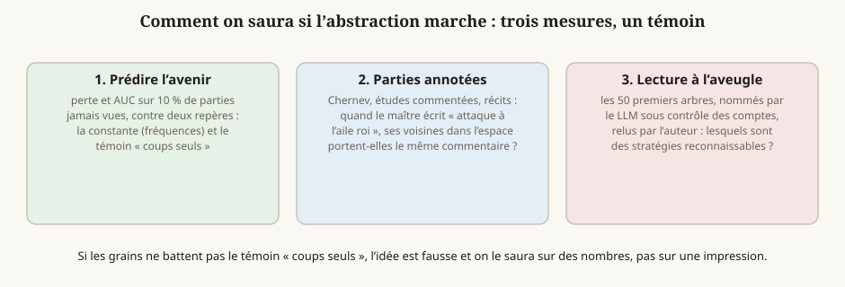
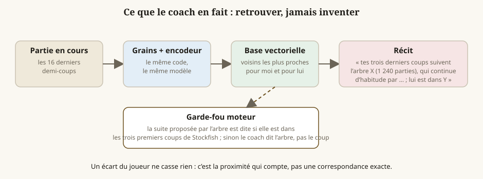
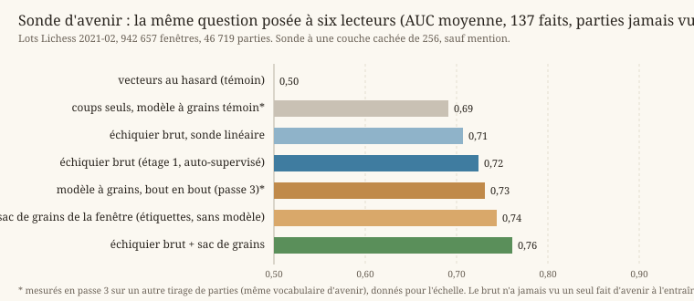

# Les arbres stratégiques appris

*Comment on fait émerger, sans règle écrite, les chorégraphies qui reviennent dans les parties humaines, pour qu'un coach parle d'intention plutôt que de coups.*

Document de travail, 6 octobre 2026. Les nombres de la section 9 couvrent les deux premières passes ; ils seront complétés à chaque passe.

---

## 1. Le problème

Un coach d'échecs pour débutants doit dire **pourquoi** on joue un coup : ce que l'adversaire prépare, ce que la position demande, où l'on va. Deux approches échouent :

- **Expliquer le coup du moteur.** Stockfish choisit un coup ; le code cherche une raison locale (« protège d4 », « développe le fou »). C'est vrai et plat : le coup du moteur n'a pas de raison exprimable à ce niveau, et le milieu de partie reste muet.
- **Écrire des règles.** Un livre d'ouverture par ouverture, une règle par plan : dès que le joueur s'écarte de ce qui est prévu, le coach se tait. Il faudrait une heuristique infinie. Et l'on n'apprend rien sur les échecs : on recopie ce qu'on croit savoir.

La troisième voie, celle de ce document : **regarder comment les petits grains s'enchaînent dans des milliers de parties humaines, laisser les gros grains apparaître, les compter, puis les nommer.**

---

## 2. Les grains : ce que le code voit

Chaque demi-coup de chaque partie devient un **grain** : un nœud qui porte tout ce que le code sait voir sur l'échiquier, sans jugement.

| Famille | Contenu | D'où ça vient |
|---|---|---|
| Identité | camp, pièce, prise, échec, roque, promotion | la partie |
| Zone d'arrivée | relative aux rois (voir §3), mon camp ou le sien | position des rois |
| Cibles | ce que la pièce jouée vise après le coup : roi, pièce, pion faible, colonne ouverte, centre | carte des attaques |
| Effets immédiats | menace, pression, soutien | `coach/move-class.mjs` |
| Atomes de structure | levier, manœuvre, échange, roque, espace, fermeture, restriction, septième | `coach/atoms.mjs` |
| Faits apparus et disparus | clouage, fourchette, pion isolé, colonne ouverte, avant-poste, bouclier abîmé, roi au centre… | `positional/` |
| Contrôle des cases | cases attaquées par zone, variation depuis le coup précédent, pression sur la zone du roi adverse | carte des attaques |
| Plans détectés | les trente concepts du catalogue, quand ils sont réalisés | `coach/plan-concepts.mjs` |

Les grains sont mécaniques : une prise est une prise, un clouage est un clouage. Aucune stratégie n'y est écrite. Le code qui les produit est `scripts/grains.mjs` ; il traite une partie en moins d'une demi-seconde.

**Le flux est bicolore** : les grains blancs et noirs alternent dans le même flux. Une attaque ne se lit pas dans les coups d'un camp seul ; elle se lit dans ce que l'un fait et ce que l'autre laisse faire.

---

## 3. L'abstraction relationnelle

Deux joueurs ne mènent jamais une attaque avec les mêmes coups. Si l'on reste au niveau des coups exacts, rien ne se ressemble jamais et rien ne fusionne. Il faut monter d'un cran : **décrire un coup par ce qu'il fait, relativement à la position, pas par la case où il va.**

Trois choix concrets :

1. **Les camps sont relatifs** : « moi » est le camp qui vient de jouer, « lui » l'adversaire. Une attaque blanche et une attaque noire sont le même objet.
2. **Les zones sont relatives aux rois** : côté de son roi, centre, côté de mon roi, dans mon camp ou dans le sien. Un pion g4 contre un roi roqué court et un pion b4 contre un roi roqué long sont le même grain : « pion vers le côté de son roi ».
3. **Les cases exactes disparaissent** : un fait garde sa nature (pion isolé, colonne ouverte, clouage) et son propriétaire, pas son adresse.

Ce que l'on perd : la précision tactique. Ce que l'on gagne : la possibilité que deux chemins différents se ressemblent. C'est le prix de l'intuition.

---

## 4. Les fenêtres et l'avenir

Le flux de chaque partie est découpé en **fenêtres de seize demi-coups** qui glissent de deux en deux, à partir du dixième coup. Chaque fenêtre est vue du camp qui vient de jouer.

À chaque fenêtre on attache son **avenir** : non pas les coups qui suivent, mais les **faits** que produisent les dix demi-coups suivants, et par qui. La pression sur son roi monte. Une colonne s'ouvre pour moi. Un pion passé apparaît. Un défenseur disparaît. Du matériel change de camp. Il roque. Je joue un levier.

Ce choix est le cœur de la méthode. **L'intention, opérationnellement, c'est l'avenir prévisible d'une suite de coups.** Deux fenêtres faites de coups différents, mais qui mènent au même avenir, doivent recevoir le même vecteur. On ne demande donc pas au modèle de reconnaître une stratégie, ce qu'il ne saurait pas faire sans qu'on la lui définisse : on lui demande de prédire ce qui va se passer, et la stratégie est ce qu'il doit comprendre pour y arriver.

Ordres de grandeur de la première passe : 88 000 parties, 2,1 millions de fenêtres, un vocabulaire de 367 traits de nœud et 139 traits d'avenir. Le code est `scripts/arbres/dataset.py`.

---

## 5. Le modèle

**Entrée.** Seize nœuds. Chaque nœud est une liste d'au plus quarante identifiants de traits ; son plongement est la somme des plongements de ses traits, à laquelle on ajoute un plongement de position dans la fenêtre.

**Architecture.** Un transformeur encodeur de quatre couches et quatre têtes, dimension 128, pré-normalisation, avec un jeton de résumé en tête de séquence. Environ 1,2 million de paramètres. Il tient en quelques minutes par époque sur la carte graphique de DENEB.

**Sorties.** Le vecteur de résumé `h` (128 nombres), puis deux têtes :

- une tête **avenir**, 139 sorties sigmoïdes, une par fait d'avenir ;
- une **projection contrastive**, 128 nombres normalisés, pour la contrainte de voisinage.

**Témoin.** Le même modèle, entraîné sur les mêmes fenêtres, mais dont l'entrée est réduite aux coups seuls : camp, pièce, prise, échec, zone d'arrivée. Il mesure ce que les grains apportent au-delà des coups. Le code est `scripts/arbres/train.py`.

---

## 6. Les deux objectifs d'apprentissage

1. **Prédire l'avenir.** Entropie croisée binaire entre les 139 probabilités et les faits réellement produits, pondérée pour que les faits rares comptent. C'est l'objectif qui force le vecteur à dire « vers quoi ça va ».
2. **Voisinage temporel.** La fenêtre qui finit au demi-coup `t` et celle qui finit à `t + 2`, dans la même partie, doivent être proches ; toutes les autres fenêtres du lot sont des contre-exemples (perte InfoNCE, température 0,1). Une chorégraphie reste au même endroit de l'espace pendant qu'elle se joue.

Perte totale : avenir + 0,5 × voisinage. Aucune étiquette humaine, aucune règle : seulement la partie elle-même.

---

## 7. L'espace vectoriel et les arbres remarquables

Toutes les fenêtres sont plongées dans l'espace par le modèle, puis rangées dans une **base vectorielle** (FAISS, produit scalaire sur vecteurs normalisés). Une base vectorielle est un classeur : on y range des millions de vecteurs et on lui demande lesquels ressemblent le plus à celui qu'on lui tend, en quelques millisecondes. Rien d'intelligent n'y habite ; l'intelligence est dans la façon dont les vecteurs ont été fabriqués.

Les fenêtres sont ensuite regroupées par **k-moyennes** (2 000 groupes dans la première passe). Un groupe est un **arbre** : la superposition de milliers de chemins qui se ressemblent et qui se ramifient de la même manière. Il est **remarquable** si :

- **Soutien** : au moins 200 parties distinctes y passent ;
- **Compacité** : ses fenêtres se ressemblent (cosinus moyen au centre) ;
- **Prévisibilité** : ses suites se ressemblent, des faits d'avenir sont présents dans au moins 40 % des membres et au moins 1,5 fois plus souvent qu'ailleurs ;
- **Saillance** : des traits de fenêtre y sont nettement sur-représentés.

Un carrefour très fréquenté dont les suites partent dans tous les sens n'est pas un arbre : il a du soutien, pas de direction.

Pour chaque arbre, l'inventaire garde ses traits saillants, ses suites habituelles, et des exemples (fenêtre et suite en coups). Le code est `scripts/arbres/index.py`.

---

## 8. Le nommage

L'arbre vient avant le nom. Trois sources, dans cet ordre :

1. **Les parties annotées.** Chernev (*Logical Chess*), les études Lichess commentées, les deux récits de référence : quand le maître a écrit « attaque à l'aile roi » sur une fenêtre, ses voisines dans l'espace, venues d'autres parties, héritent de l'indice.
2. **Le LLM sous contrôle.** Il reçoit les traits saillants, les suites habituelles et six exemples, et propose un nom, une phrase de sens, et les traits sur lesquels il s'appuie. Ces traits doivent figurer dans la liste fournie ; sinon le nom est marqué non vérifié. Il travaille hors ligne, par lots ; en direct, le coach ne fait que retrouver.
3. **La lecture à l'aveugle** par l'auteur des cinquante premiers arbres : lesquels sont des stratégies reconnaissables.

Le code est `scripts/arbres/nommer.mjs`.

---

## 9. Comment on saura si ça marche

Trois mesures, un témoin :

| Mesure | Passe 1 (toutes phases, 88 000 parties) | Passe 2 (milieu de jeu, 136 000) | Passe 3 (milieu, sans séquences d'échecs, 136 000) |
|---|---|---|---|
| Fenêtres | 2 120 787 | 2 480 587 | 1 925 811 |
| AUC moyenne de la prédiction de l'avenir, parties jamais vues, modèle grains | 0,763 | 0,743 | 0,731 |
| Même mesure, témoin coups seuls | 0,728 | 0,703 | 0,691 |
| Même mesure, constante (fréquences) | 0,500 | 0,500 | 0,500 |
| Même mesure, modèle sans les étiquettes de plan | 0,763 | — | — |
| Arbres retenus | 1 998 groupes fins | 300 arbres | 200 arbres |
| Sur les premiers nommés : finales / milieu / ouverture | 20 / 30 / 0 | 25 / 26 / 9 | 8 / 51 / 21 |
| Accord avec les commentaires de Chernev (57 paires, jugées par Fable) | — | — | même idée 2 %, voisine 42 %, rien à voir 56 % |

Échelle de 40 demi-coups (passe 3, 281 000 fenêtres seulement, 3 époques) : AUC 0,667, arbres dominés par les séquences d'échecs ; non concluant à cette taille.

Lecture honnête, passe 1 : les grains aident modestement ; les premiers arbres sont dominés par les étiquettes de plan « rupture » et par les finales ; le modèle entraîné sans les étiquettes de plan prédit aussi bien, donc l'apprentissage ne dépend pas de mes règles. Passe 2 : l'écart entre grains et coups seuls s'élargit en milieu de jeu (+0,04) ; les arbres sont plus variés : lutte pour la colonne ouverte, attaque du pion isolé, assaut du roi par la colonne ouverte, chasse au roi non roqué, levier devant son propre roi, assaut de pions avant le roque, centre fermé et mauvais fou, pion isolé devenu passé ; mais les chasses au roi par échecs répétés forment encore un gros paquet de doublons. Passe 3 : les échecs écartés, l'écart grains / coups seuls se maintient (+0,04) ; 51 arbres de milieu de jeu sur 80, mais beaucoup sont des situations génériques (roque, colonne ouverte, développement achevé) plutôt que des intentions ; l'accord avec Chernev est faible, et le test lui-même compare deux grains de finesse différents : le maître commente le but d'UN coup (« empêche Cf5 », « ouvre la voie à la dame »), l'arbre décrit le contexte de seize demi-coups. C'est la limite du vocabulaire actuel, pas seulement du test.

Les deux passes ont retrouvé seules des choses connues : l'attaque de minorité (« rupture b4 contre la chaîne c5, préparée par a3 et Tb1 »), la libération en hérisson (« …b5 ou …d5 une fois développé »), le centre bloqué avec assauts sur ailes opposées.

Les deux autres mesures, accord avec les parties annotées et lecture à l'aveugle, viennent après le nommage.

---

## 10. Ce que le coach en fera

À chaque coup : les seize derniers demi-coups deviennent des grains, puis un vecteur, puis les arbres les plus proches pour chaque camp. Le coach dit : « tes trois derniers coups suivent l'arbre X, vu dans 1 240 parties à ce niveau, qui continue d'habitude par ceci ; lui est dans l'arbre Y, voilà ce qu'il faut craindre ». Le moteur garde son rôle de garde-fou : la suite proposée par l'arbre n'est dite comme conseil que si elle est dans ses trois premiers coups. Un écart du joueur ne casse rien : c'est la proximité qui compte.

---

## 11. Ce que les trois passes ont appris, et la suite

- Les grains relationnels aident à prédire l'avenir au-delà des coups seuls, de façon stable (+0,04 d'AUC sur trois passes). L'apprentissage ne dépend pas des étiquettes de plan.
- Des stratégies connues émergent seules, mais la majorité des arbres décrivent des situations, pas des intentions, et l'accord avec les commentaires des maîtres est faible : le vocabulaire de mes détecteurs borne ce que l'espace peut distinguer.
- Suite décidée avec l'auteur : **laisser le modèle apprendre sur l'échiquier brut** (étage 1, auto-supervisé sur le million et demi de parties, sans aucune de mes étiquettes en entrée), puis **greffer les noms** (étage 2 : fenêtres commentées par les maîtres, plans du catalogue, arbres nommés, projetés dans l'espace ; une petite couche apprend à lire chaque nom ; les régions sans nom restent muettes : l'explicable d'abord). Prérequis : un corpus annoté de 2 000 à 5 000 coups commentés par plusieurs auteurs (études Lichess publiques, livres du domaine public), et un test d'accord au bon grain : le commentaire d'un coup contre ce que l'arbre prédit pour ce coup, pas contre le contexte entier.

## 12. Les limites connues

- Les grains viennent de mes détecteurs. Ils sont descriptifs, pas stratégiques, mais leur grain de finesse borne ce que le modèle peut distinguer. Deux grosseurs seront comparées.
- Seize demi-coups peuvent être trop courts pour la stratégie. Des fenêtres de quarante seront mesurées.
- Les parties Lichess à 2400 sont surtout du blitz : les stratégies y sont présentes mais plus brouillonnes.
- Le nommage par LLM reste une explication produite par un modèle de langage, hors ligne et vérifiée par les comptes ; une erreur de nom est possible, mais elle est visible et corrigible, et elle n'invente rien en direct.

## 13. Étage 1 : apprendre sur l'échiquier brut (6 octobre, soir)

Décision de la section 11 mise en œuvre le soir même. Le modèle ne reçoit plus aucun de mes grains : seulement, pour chacun des seize derniers demi-coups, les 64 cases telles quelles (pièce et couleur), le trait, les droits de roque et le coup qui vient d'être joué (case de départ, case d'arrivée, prise, échec). L'échiquier est retourné pour les Noirs : « moi » est toujours en bas. Il doit deviner le coup suivant (case de départ et case d'arrivée) et reconnaître la fenêtre suivante de la même partie parmi 255 autres. C'est le registre de Maia (lire les humains), pas celui d'AlphaZero (jouer mieux qu'eux).

**Données.** 348 000 parties Lichess Elite (2021-02 et 2021-03), 7,7 millions de fenêtres. Un petit modèle (d = 128, 4 couches) apprend en 10 minutes par époque sur le GPU, deux fois plus vite que le modèle à grains.

**Prochain coup.** Après trois époques, il devine la case de départ 47 fois sur 100, la case d'arrivée 33 fois sur 100, le coup exact 21 fois sur 100, sur des parties jamais vues. Pour l'échelle : un modèle qui ne verrait que la position et aucune histoire ferait sans doute mieux ; ici le coup n'est qu'un prétexte pour forcer le modèle à lire la séquence.

**La sonde (début de l'étage 2).** On fige les vecteurs et on apprend une petite tête (une couche cachée de 256) qui doit prédire les 141 faits d'avenir de la section 6, sur les 46 719 parties de 2021-02 qui ont aussi des grains ; mesure sur des parties que ni le modèle ni la sonde n'ont vues.

| Lecteur | AUC moyenne |
|---|---|
| vecteurs au hasard (témoin) | 0,50 |
| coups seuls (témoin de la passe 3) | 0,69 |
| échiquier brut, sonde linéaire | 0,71 |
| échiquier brut, sonde à une couche cachée | **0,72** |
| modèle à grains bout en bout (passe 3) | 0,73 |
| sac de grains de la fenêtre, sans modèle | 0,74 |
| échiquier brut + sac de grains | **0,76** |

Trois lectures :

1. **Le modèle brut a appris quelque chose de réel sans aucune étiquette** : 0,72 contre 0,50 au hasard et 0,69 pour les coups seuls, alors qu'il n'a jamais vu un seul fait d'avenir et que la sonde n'a qu'une couche.
2. **Humilité pour la passe 3** : un simple sac des grains de la fenêtre, sans transformeur, fait 0,74, soit mieux que le modèle à grains bout en bout (0,73). Le transformeur sur grains n'ajoutait rien à la somme des étiquettes.
3. **Les deux sont complémentaires** : brut + sac donne 0,76, le meilleur score à ce jour. L'échiquier brut contient des régularités que mes détecteurs ne décrivent pas, et réciproquement. C'est exactement l'argument des deux étages : l'espace brut porte plus que les étiquettes, et les étiquettes servent à le lire.

**Version 2 (horizon de dix demi-coups, voisin à huit, d = 192, 6 couches, 4 époques, 46 minutes).** Coup exact deviné 25 fois sur 100. Sonde : **0,750 seul** (il dépasse maintenant le sac de grains, 0,744, et le modèle à grains bout en bout, 0,731) et **0,773 avec le sac**. Premier groupe de l'inventaire : « je pousse un levier → il aura un pion doublé, une colonne semi-ouverte, un avant-poste » : une lecture de structure, pas une reprise.

**Ce que le thermomètre vaut.** L'auteur a remarqué que « quoi qu'on fasse, on arrive au même chiffre ». Le détail par fait (sonde brut + sac, modèle OTB lu sur Lichess) l'explique : 25 faits au-dessus de 0,85 (le roque qui arrive, le bouclier de pions, le développement : des faits déjà inscrits sur l'échiquier), 33 entre 0,75 et 0,85, et 79 entre 0,60 et 0,75 (« un échange aura lieu », « une manœuvre », « une case faible », « un pion isolé » : présents dans 30 à 50 % des fenêtres quoi qu'il arrive, presque du bruit à dix demi-coups). La moyenne est écrasée par ces 79 faits mal définis et gonflée par les 25 évidents. Deux fois et demie plus de données (OTB) n'ont donné que +0,005 : ce n'est pas la taille qui manque, c'est la cible. Là où l'espace brut dépasse nettement les étiquettes : ce que le camp va faire au centre (0,79 contre 0,67), la structure, le matériel. **Mesures à construire** : (1) les mots des maîtres comme cible, au grain du coup (16 000 commentaires, 84 études) ; (2) un avenir plus loin et plus net (trente demi-coups : où vont les pièces, la structure change-t-elle au centre, le roi adverse est-il attaqué) ; (3) la lecture à l'aveugle des arbres par l'auteur.

**Les groupes de l'espace brut v1** (200 arbres, lus a posteriori par les grains de 2021-02) étaient dominés par le très court terme : « je viens de prendre un cavalier au centre → il reprend » arrive en tête, parce que l'objectif « coup suivant » récompense surtout la reprise immédiate. C'est le défaut attendu de cet objectif, corrigé en partie par la version 2 (voir ci-dessus).

**Second corpus : les maîtres sur l'échiquier.** LumbrasGigabase « OTB Elite » (CC BY-NC-SA 4.0) : 864 000 parties jouées à la pendule entre joueurs classés au-dessus de 2400, de 1990 à 2026. Plateaux extraits (826 000 parties de trente demi-coups ou plus, 18,5 millions de fenêtres), même modèle, 47 minutes de GPU ; coup exact deviné 22 fois sur 100. Un échantillon de 13 200 de ces parties a reçu des grains pour sonder cet espace de la même manière, et chaque modèle a aussi été sondé sur les parties de l'autre :

| Sonde (couche cachée de 256) | sur parties Lichess (943 k fenêtres) | sur parties OTB (273 k fenêtres) |
|---|---|---|
| modèle élevé sur Lichess | 0,724 | 0,711 |
| modèle élevé sur OTB | **0,729** | **0,716** |
| sac de grains, sans modèle | 0,744 | 0,728 |

Lecture : le modèle élevé sur les maîtres lit un peu mieux les deux populations, y compris le blitz en ligne, sans doute parce qu'il a vu deux fois et demie plus de fenêtres. Les deux espaces se transfèrent d'une population à l'autre presque sans perte. Les colonnes ne se comparent pas entre elles (la sonde OTB apprend sur trois fois moins de fenêtres). La question « des régularités différentes chez les maîtres ? » n'est donc pas tranchée par cette sonde ; elle le sera par l'inventaire des arbres, dont les premiers groupes OTB ressemblent à ceux de Lichess (reprise au centre, roque adverse, pion isolé puis colonne semi-ouverte), avec une place plus visible pour les structures de pions (majorité à l'aile dame, chaîne de pions).

**Corpus annoté multi-auteurs.** 314 études Lichess publiques lues, 97 gardées (au moins trente commentaires de fond), 20 053 commentaires : Chernev, Capablanca (*Chess Fundamentals*), Steinitz–Chigorin et Steinitz–Zukertort, La Bourdonnais–McDonnell annoté par Morphy, Fischer, et des parties amateurs commentées par leurs auteurs. À dédoublonner (Chernev y est cinq fois). Il servira au test d'accord au grain du coup : le commentaire d'un coup contre l'avenir que la sonde prédit pour ce coup.

## 14. L'épreuve des mots des maîtres (nuit du 6 au 7 octobre)

Le thermomètre de la section 13 plafonnait parce que sa cible était mal choisie. Nouvelle épreuve, construite dans la nuit : **le vecteur de la fenêtre qui se termine par un coup commenté sait-il de quoi parle le commentateur ?**

**Matière.** 84 études Lichess uniques, 1 076 chapitres rejoués (variations ignorées, coups commentés rattachés au coup qu'ils suivent), 12 022 commentaires, 9 914 après le quinzième demi-coup. Chaque commentaire classé par Fable en un à trois thèmes parmi dix-sept thèmes stratégiques (attaque de roi, défense du roi, colonne ouverte, structure, case faible, échange de pièces, développement, centre, levier, prophylaxie, manœuvre, initiative, tactique, finale, matériel, blocus, aile dame) plus trois poubelles (évaluation, erreur, autre). 8 834 coups gardés. Un lexique de mots-clés a servi d'étalon grossier avant Fable.

**Protocole.** Petite tête à une couche cachée, validation croisée en cinq plis **par étude** : un annotateur n'est jamais à la fois en apprentissage et en test. Témoins : vecteurs au hasard ; **traits triviaux** (numéro du coup, camp, matériel des deux camps, nombre de pièces, droits de roque, prise, échec) ; sac des grains de la fenêtre.

| Lecteur | AUC moyenne, 17 thèmes |
|---|---|
| vecteurs au hasard | 0,49 |
| sac de grains (nos étiquettes, sans modèle) | 0,64 |
| traits triviaux | 0,66 |
| espace brut v1 | 0,67 |
| espace OTB | 0,68 |
| espace brut v2 | 0,68 |
| espace brut v3 (horizon trente demi-coups) | **0,68** (0,681) |
| brut v3 + triviaux | 0,69 |

**Par thème**, là où l'espace dépasse nettement les traits triviaux : aile dame (0,76 contre 0,67), levier (0,73 contre 0,69), attaque de roi (0,70 contre 0,67), case faible (0,68 contre 0,64), défense du roi (0,62 contre 0,57). Là où il ne dépasse rien : finale (0,88, mais 0,91 avec le seul compte du matériel), développement, centre, manœuvre, prophylaxie, échange, tactique, initiative (0,58).

**Lecture honnête.**

1. L'espace brut lit les mots des maîtres **mieux que nos étiquettes à la main** (0,68 contre 0,64) et sur tous les thèmes sauf la case faible. C'est l'argument le plus solide à ce jour pour l'étage 1 contre les grains.
2. Mais il ne dépasse les traits triviaux que de 0,015 en moyenne. Le signal existe, sur une poignée de thèmes de terrain (où l'on joue, contre quoi), et il est mince. Pas d'émergence à cette échelle : seize demi-coups, 128 à 192 dimensions, quatre époques.
3. La version 3 (horizon de trente demi-coups, voisin à seize) confirme la tendance : avenir 0,757 seul et 0,776 avec le sac, mots des maîtres 0,681, soit quelques millièmes de mieux que la v2 à chaque fois. Allonger l'horizon de l'objectif ne suffit pas.
4. Les thèmes abstraits (prophylaxie, initiative, moment de l'échange) ne se lisent ni dans l'espace, ni dans les étiquettes, ni dans le trivial. Soit ils vivent à une autre échelle de temps, soit ils ne sont pas dans la position mais dans la tête du commentateur.

**Ce que ça décide.** Ne plus chercher l'intention en changeant l'objectif à la marge. Changer d'échelle (fenêtres de quarante à soixante demi-coups, modèle plusieurs fois plus large, dix époques, les deux corpus réunis), ce qui est le cas où louer une grosse carte quelques heures se justifie ; ou changer de représentation. Cette épreuve reste le juge : elle est reproductible en dix minutes sur n'importe quel nouvel espace (`sonder-mots.py`).

## 15. L'échelle, sur une H100 louée (7 octobre, soir)

Pod RunPod (H100 SXM 80 Go, 3,49 $ de l'heure, Islande), monté par l'auteur en une heure ; données acheminées depuis DENEB (goulot : 5 Mo/s par connexion vers le pod, 15 Mo/s en quatre flux ; la fibre de l'auteur monte à 700 Mbit/s). Scripts inchangés, avec trois ajouts : précision mixte bf16, préchargement des lots dans un fil, sauvegarde à chaque époque et reprise (`--resume`), parce que le pod a redémarré une fois sans prévenir.

**Modèle « échelle »** : fenêtres de 40 demi-coups, 384 dimensions, 8 couches, 8 têtes, horizon 30, voisin à 8, six époques sur les 348 000 parties Lichess (5,0 millions de fenêtres), 2 h 20 de H100, 16 millions de paramètres (64 Mo). Coup exact : 12,5 → 18,7 → 22,4 → 24,9 → 26,6 → **27,1 %** (v3 hier : 23,6 %). Sonde d'avenir : **0,763** seul, 0,780 avec le sac (v3 : 0,757 / 0,776).

**Épreuve des mots des maîtres.** Premier chiffre : 0,803 contre 0,657 au trivial. Annoncé trop vite comme une émergence : la fenêtre de 40 ne sonde que les coups commentés après le 39e demi-coup (4 284 coups au lieu de 8 834), qui sont bien plus lisibles que ceux de l'ouverture. **Rejoué sur exactement les mêmes coups, le modèle v2 d'hier fait 0,785.** Le gain réel de l'échelle est de **+0,02** (0,785 → 0,803), petit mais dans le même sens sur presque tous les thèmes : tactique et échange +0,04, initiative, manœuvre et développement +0,03, structure, case faible, colonne, matériel +0,02, levier et aile dame 0.

Trois choses apprises :

1. **Le milieu de jeu se lit.** Sur les coups après le 39e demi-coup, les deux modèles lisent les thèmes des maîtres à 0,79 et 0,80, loin du trivial (0,66), y compris les thèmes « dans la tête » (prophylaxie 0,79, initiative 0,74, échange 0,78) qui semblaient hors de portée hier soir sur l'ensemble des coups. Ce qui tirait le score vers le bas hier, c'étaient les commentaires d'ouverture.
2. **Grossir seul ne fait pas de miracle** : +0,02 pour un modèle quatre fois plus large et des fenêtres deux fois et demie plus longues. Les prochains dollars iront plutôt à plus de parties (un mois sur trois seulement a été utilisé) et au test de la longueur de fenêtre à taille égale.
3. **Le modèle reste petit à l'usage** : 64 Mo, une passe avant en quelques millisecondes sur le processeur du VPS. Seule la base vectorielle est lourde (5 millions × 384 = 7,7 Go) ; un index FAISS compressé la ramène à une centaine de Mo.

**Modèle OTB à la même échelle** (826 000 parties de maîtres, 12,0 millions de fenêtres, six époques, 2 h 40 de H100, environ 9,5 $) : coup exact 26,7 %, sonde d'avenir sur les parties de maîtres 0,724 (petit modèle OTB d'hier : 0,716), **mots des maîtres 0,806 contre 0,804 pour le modèle Lichess, sur les mêmes 4 284 coups**. Réponse à la question « les maîtres portent-ils d'autres régularités que le blitz ? » : pas que cette épreuve sache voir. Les deux espaces lisent les commentaires des maîtres pareil, à deux millièmes près. Le corpus de maîtres n'apporte donc pas, à cette échelle et avec ce juge, une lecture différente ; il reste utile comme second témoin et pour doubler le nombre de parties.

---

## Annexe : fichiers

| Étape | Code | Sorties |
|---|---|---|
| Grains | `scripts/grains.mjs` | `data/grains/*.jsonl` |
| Fenêtres | `scripts/arbres/dataset.py` | `windows.npz`, `windows.vocab.json`, `windows.meta.jsonl` |
| Modèle et témoin | `scripts/arbres/train.py` | `model.pt`, `model.emb.npy`, `model.report.json` |
| Base et arbres | `scripts/arbres/index.py` | `arbres.faiss`, `arbres.labels.npy`, `arbres.inventaire.json` |
| Nommage | `scripts/arbres/nommer.mjs` | `noms.json` |
| Inventaire lisible | `scripts/arbres/inventaire-page.py` | page HTML |
| Chaîne DENEB | `scripts/arbres/chaine-deneb.sh` | journaux `logs/arbres-*.log` |
| Plateaux bruts (étage 1) | `scripts/plateaux.mjs` | `data/plateaux/*.bin`, `*.idx.jsonl` |
| Modèle brut | `scripts/arbres/train-brut.py` | `data/brut*/model.{pt,emb.npy,meta.jsonl,report.json}` |
| Sonde d'avenir | `scripts/arbres/sonder.py` | `data/brut*/sonde*.json` |
| Arbres de l'espace brut | `scripts/arbres/index-brut.py` | `data/brut*/arbres.*` |
| Corpus annoté | `scripts/arbres/corpus-annote.mjs` | `data/reference/annotes/` |
| Coups commentés | `scripts/arbres/annotes-coups.mjs` | `coups.jsonl`, `data/plateaux/annotes.bin` |
| Thèmes des commentaires | `scripts/arbres/themes-fable.mjs`, `themes-lexique.py` | `themes-fable.jsonl`, `themes-lexique.jsonl` |
| Épreuve des mots | `scripts/arbres/sonder-mots.py` | `sonde-mots-*.json` |
