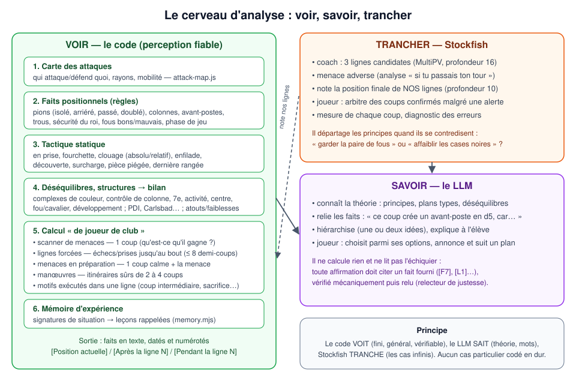
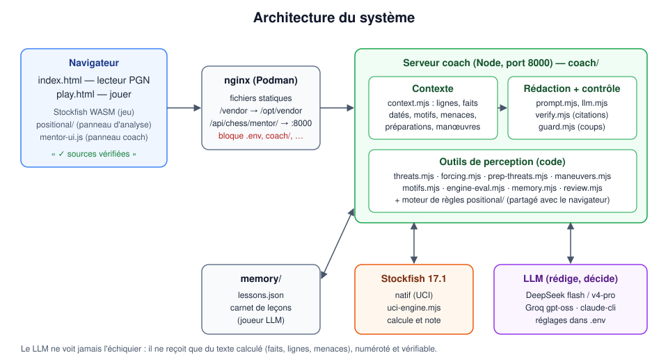
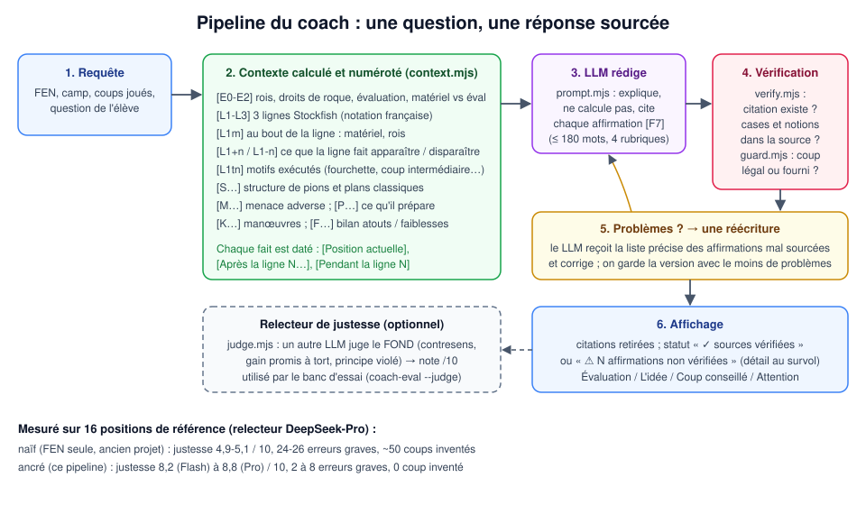
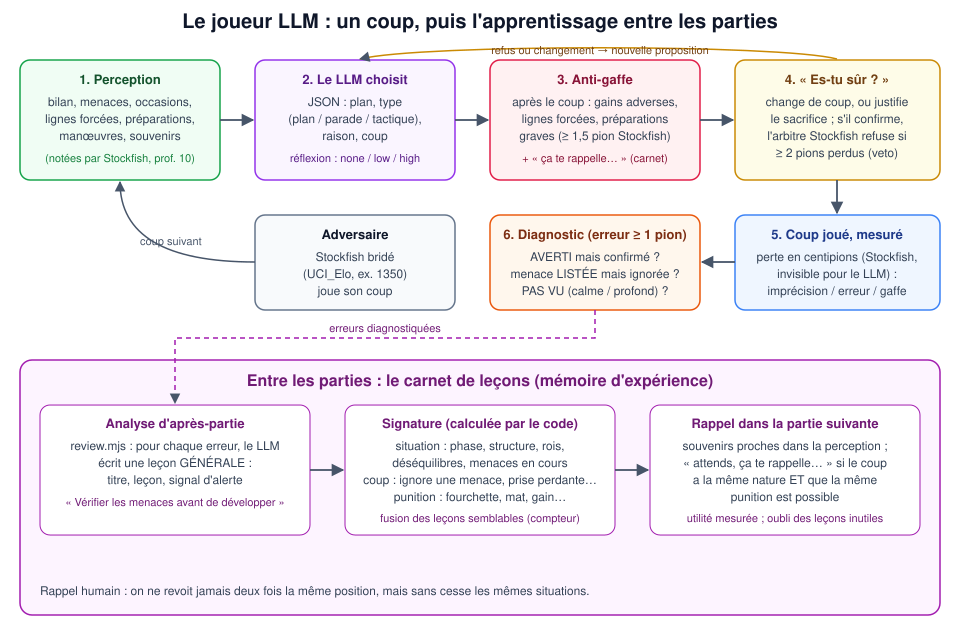

# Architecture fonctionnelle — le cerveau d'analyse

> Document de référence pour reprendre le projet « à tête froide ».
> Il décrit **ce que fait** chaque brique et **pourquoi**, les résultats mesurés, et les limites connues.
> Dernière mise à jour : septembre 2026 (branche `coach-grounded`).

## Sommaire

1. [Le problème de départ](#1-le-problème-de-départ)
2. [Le principe : voir, savoir, trancher](#2-le-principe--voir-savoir-trancher)
3. [Vue d'ensemble du système](#3-vue-densemble-du-système)
4. [Le cerveau d'analyse, couche par couche](#4-le-cerveau-danalyse-couche-par-couche)
5. [Le coach (produit)](#5-le-coach-produit)
6. [Le joueur LLM (expérience)](#6-le-joueur-llm-expérience)
7. [La mémoire d'expérience](#7-la-mémoire-dexpérience)
8. [Fournisseurs LLM et réglages](#8-fournisseurs-llm-et-réglages)
8 bis. [Profil de style d'un joueur](#8-bis-profil-de-style-dun-joueur)
8 ter. [Portrait d'un joueur](#8-ter-portrait-dun-joueur)
9. [Résultats mesurés](#9-résultats-mesurés)
10. [Limites connues et pistes d'amélioration](#10-limites-connues-et-pistes-damélioration)
11. [Carte des fichiers](#11-carte-des-fichiers)
12. [Commandes utiles](#12-commandes-utiles)
13. [Glossaire](#13-glossaire)

---

## 1. Le problème de départ

Le projet initial envoyait au LLM la position (FEN), les coups joués et la question de l'élève, et lui demandait d'expliquer un plan. Conclusion tirée à l'époque : *« un LLM est incapable d'expliquer une stratégie »*.

Le diagnostic a montré une autre cause : **le LLM travaillait à l'aveugle**. Il devait lire l'échiquier à partir d'une FEN, calculer des variantes et en déduire un plan. Or un LLM n'a pas de vision spatiale : il invente des pièces, voit des menaces inexistantes, propose des coups illégaux. L'évaluation Stockfish et les faits positionnels étaient calculés dans le navigateur, mais **jamais transmis** au LLM.

Mesure (§9) : le même modèle passe de **5/10 de justesse et une erreur grave presque à chaque réponse** (mode « naïf », FEN seule) à **8 à 9/10 et zéro coup inventé** quand on lui fournit une analyse calculée.

## 2. Le principe : voir, savoir, trancher



Chacun fait ce qu'il sait faire :

| Rôle | Qui | Pourquoi |
|---|---|---|
| **Voir** l'échiquier | le code (moteur de règles et outils de perception) | fini, général, vérifiable ; c'est exactement ce que le LLM rate |
| **Savoir** la théorie | le LLM | il connaît les principes, les plans types, les déséquilibres, et sait les expliquer |
| **Trancher** entre des principes contradictoires | Stockfish | les cas sont infinis ; seul le calcul départage « garder la paire de fous » et « affaiblir les cases noires » |

Règle d'or : **aucun cas particulier codé en dur.** Le code n'implémente que des définitions générales (un avant-poste, un clouage, une pièce en prise) ; quand une définition est fausse, on la corrige pour tous les cas.

## 3. Vue d'ensemble du système



- **Navigateur** : lecteur PGN (`index.html`) et partie contre Stockfish (`play.html`, Stockfish WASM). Le panneau d'analyse positionnelle utilise le même moteur de règles (`positional/`) que le serveur.
- **nginx (Podman)** : sert les fichiers. En développement, tout le dépôt est monté sur la racine web (édition, puis F5). Le vendor (chess.js, Stockfish WASM) vient de l'image (`/opt/vendor`). **nginx bloque** `.env`, `coach/`, `node_modules/`, `.md`, `.mjs`, `.json`, etc.
- **Serveur coach** (`coach/server.mjs`, port 8000, derrière `/api/chess/mentor/`) : construit le contexte, appelle le LLM, vérifie la réponse.
- **Stockfish 17.1 natif** (`coach/uci-engine.mjs`) : calcule et note.
- **LLM** (`coach/llm.mjs`) : DeepSeek, Groq, Claude (CLI) ou API compatible OpenAI ; configuration dans `.env`.

## 4. Le cerveau d'analyse, couche par couche

### 4.1 Carte des attaques — `positional/attack-map.js`
Qui attaque et défend quoi, rayons des pièces à longue portée, mobilité. Pseudo-légale (ignore clouages et échecs) : elle décrit la **géométrie**, Stockfish juge. C'est la base commune des détecteurs tactiques et stratégiques.

### 4.2 Faits positionnels — `positional/*.js`
Des « jetons » `{ id, params }` produits par des règles : structure de pions (isolé, arriéré au sens classique, passé, doublé, îlots, majorités, chaînes), colonnes ouvertes et semi-ouvertes, avant-postes (inattaquables **à jamais** par un pion adverse), trous (cases que plus aucun pion ami ne couvrira), sécurité du roi (roque, bouclier, droits de roque), fous bons ou mauvais (pions **fixés** sur leur couleur), phase de jeu.

### 4.3 Tactique statique — `positional/piece-attacks.js`
Pièce réellement en prise (non défendue, ou attaquée par moins cher), fourchette rentable, clouage absolu et relatif (pas de clouage si la pièce peut prendre la pièce clouante), enfilade, découverte possible, surcharge, pièce piégée, dernière rangée faible.

### 4.4 Déséquilibres, structures et bilan
- `positional/imbalances.js` : complexes de couleur affaiblis (sans le fou de cette couleur), contrôle de colonne et cases d'entrée, tour en 7e, activité, pièces passives (gêne des **pions** seulement), contrôle du centre, centre ouvert ou fermé, fou contre cavalier, avance de développement.
- `positional/structures.js` : structures types (pion dame isolé, pions pendants, Carlsbad, chaînes d4-e5 et d5-e4, Maroczy, structure sicilienne), plans classiques associés, roques opposés avec les ailes explicites (« chaque camp attaque du côté du roi adverse »).
- `positional/balance.js` : chaque fait devient un **atout** ou une **faiblesse** d'un camp : la « feuille de bilan » à la Silman envoyée au LLM.

### 4.5 Calcul « de joueur de club » — `coach/`
| Outil | Question humaine | Profondeur |
|---|---|---|
| `threats.mjs` (scanner) | « qu'est-ce qu'il gagne s'il joue maintenant ? » et « qu'est-ce que je peux gagner ? » | 1 coup |
| `forcing.mjs` (lignes forcées) | « si je force, qu'est-ce que ça donne ? » : échecs, prises, promotions, toutes les parades en échec ; chaque camp peut s'arrêter | ≤ 8 demi-coups |
| `prep-threats.mjs` (menaces en préparation) | « qu'est-ce qu'il prépare ? » : un coup calme adverse, puis la menace créée | 1 coup calme + 1 coup |
| `maneuvers.mjs` (manœuvres) | « où va mon cavalier ? » : itinéraires sûrs vers avant-postes, trous, cases de blocage, pions faibles, colonnes, 7e | 2 à 4 coups |
| `motifs.mjs` | « qu'est-ce que fait ce coup du moteur ? » : fourchette, clouage, enfilade, découverte, échec double, coup intermédiaire, sacrifice, déviation | le long d'une ligne |

**Notation des lignes** : `engine-eval.mjs`. Nos outils **choisissent** les lignes ; Stockfish (profondeur 10) **note seulement la position où elles aboutissent**, comparée au matériel actuel. On évite ainsi les faux gains du simple décompte (piège de l'éléphant : Fxd8 ne « gagne » pas la dame à cause de Fb4+).

### 4.6 Le temps des faits
Chaque fait envoyé au LLM est daté : `[Position actuelle]`, `[Après la ligne N, au bout de « … »]` ou `[Pendant la ligne N]`, avec l'état des rois et des droits de roque aux deux moments. Ce marquage a supprimé la cause principale d'erreurs graves du coach : appliquer un fait d'aujourd'hui à la position d'après la ligne (« roque », alors que le roi a déjà bougé).

## 5. Le coach (produit)



1. **Requête** : FEN, camp, coups joués, question.
2. **Contexte** (`context.mjs`) : 3 lignes Stockfish (MultiPV, profondeur 16), ce que chaque ligne fait apparaître ou disparaître (différence de faits à un horizon « calme »), motifs exécutés, menace adverse (Stockfish, « si tu passais ton tour »), ce que l'adversaire prépare, manœuvres, structure et plans classiques, bilan des déséquilibres. **Tout est numéroté** : `[E…] [L…] [S…] [M…] [P…] [K…] [F…]`.
3. **Rédaction** (`prompt.mjs`) : le LLM explique sans calculer, en 4 rubriques (Évaluation, L'idée, Coup conseillé, Attention), ≤ 180 mots, **en citant la source de chaque affirmation**.
4. **Vérification** : `verify.mjs` (la citation existe, les cases et les notions employées figurent dans la source citée, pas d'affirmation concrète sans source) et `guard.mjs` (tout coup cité est légal ou présent dans les lignes fournies).
5. **Réécriture** : s'il y a des problèmes, une seule, avec la liste précise des affirmations mal sourcées.
6. **Affichage** : citations retirées, statut « ✓ sources vérifiées » ou « ⚠ N affirmations non vérifiées ».

**Relecteur de justesse** (`judge.mjs`, optionnel) : un second LLM juge le **fond** (contresens stratégique, gain promis à tort, principe violé). Il note le banc d'essai. La vérification mécanique contrôle la cohérence avec les sources ; seul le relecteur attrape un raisonnement faux bâti sur des faits vrais.

## 6. Le joueur LLM (expérience)



Question de recherche : *un LLM peut-il jouer avec des principes et une perception fiable, **sans les lignes de Stockfish** ?* (`scripts/llm-plays.mjs`)

| Qui | Rôle | Le LLM le voit-il ? |
|---|---|---|
| Le LLM | choisit chaque coup, annonce un plan et le type du coup (plan, parade, tactique) | — |
| Notre code | perception : bilan, menaces, occasions, lignes forcées, préparations, manœuvres, souvenirs | **oui**, c'est tout ce qu'il reçoit |
| Stockfish n° 1 (bridé, `UCI_Elo`) | l'adversaire | ses coups seulement |
| Stockfish n° 2 | mesure la perte de chaque coup, note nos lignes (profondeur 10) | les notes de nos lignes, jamais ses propres coups |
| Stockfish n° 2, arbitre | refuse un coup **confirmé malgré une alerte** s'il perd ≥ 2 pions | le refus seulement (compté à part) |
| Stockfish après coup | diagnostic et leçons | entre deux parties |

**Déroulé d'un coup** : perception → choix (réflexion `none` au calme, `low` en position critique, `high` après une alerte) → anti-gaffe (gains adverses, lignes forcées, préparations graves, souvenir « ça te rappelle… ») → « es-tu sûr ? » → arbitre → coup joué et mesuré → diagnostic si erreur. Le coup de secours (après trop de refus) est le moins coûteux des coups **proposés par le LLM**, jamais un coup arbitraire.

**Diagnostic** (`diagnose.mjs`) : la réfutation de Stockfish est comparée à ce que le LLM avait sous les yeux : **AVERTI** (alerté mais a confirmé), **LISTÉE** (menace affichée mais ignorée), **PAS VU** (coup calme, coup calme puis tactique, tactique profonde).

## 7. La mémoire d'expérience

Objectif : *se souvenir de situations semblables, pas de positions exactes*, comme un humain qui se dit « ça me rappelle une partie où… ».

- **Analyse d'après-partie** (`review.mjs`) : pour chaque erreur, le LLM écrit une leçon **générale** (titre, leçon, signal d'alerte). Exemple réel : *« Vérifier les menaces avant de développer : un coup de développement qui ignore une menace de mat est toujours perdant »*.
- **Signature** (`memory.mjs`), calculée par le code : situation (phase, structure, sécurité des rois, déséquilibres, **menaces en cours**), **nature du coup** (ignore une menace, prise perdante, échec gratuit, sortie de dame, pion devant son roi, quitte le roi…), motif de la punition.
- **Rappel** : souvenirs proches dans la perception ; « attends, ça te rappelle… » seulement si la **nature** du coup correspond (la pièce jouée compte peu) **et** si la même punition est possible après le coup.
- **Consolidation** : fusion des leçons semblables (compteur), mesure de l'utilité de chaque rappel (Stockfish vérifie le coup abandonné), oubli des leçons jamais utiles. Carnet : `memory/lessons.json` (non versionné, modifiable à la main).

## 8. Fournisseurs LLM et réglages

| Fournisseur | Modèles | Réflexion | Remarques |
|---|---|---|---|
| `deepseek` | `deepseek-flash` (V4.1-Flash), `deepseek-v4-pro` | `reasoning_effort` (`low` / `high` / `max`) **avec** `thinking: {type: enabled}`, ou `thinking: disabled` | La doc exige les deux paramètres ensemble ; seul, `reasoning_effort` est ignoré. `temperature` est ignorée en mode réflexion. |
| `groq` | `openai/gpt-oss-120b`, `qwen/qwen3.8-27b` | `reasoning_effort` (gpt-oss) | Très rapide, mais la limite de débit de l'offre gratuite domine ; 27 réponses illégales en une partie. |
| `claude-cli` | `sonnet`, `claude-opus-5-5`… | `--effort` | **Consomme l'abonnement Claude** : usage personnel uniquement, jamais pour un site public. |
| `openai`, `anthropic` | — | — | Via clé API. |

Reprise automatique sur limite de débit (429) et pannes 5xx, avec le délai annoncé. Variables : `LLM_PROVIDER`, `LLM_MODEL`, `LLM_API_KEY`, `GROQ_API_KEY`, `LLM_EFFORT`, `JUDGE_*` (relecteur), `COACH_MEMORY`.

## 8 bis. Profil de style d'un joueur

Objectif : détecter un style (« il attaque sans arrêt », « il est prudent ») à partir des **coups joués**, pas d'étiquettes. Chaque trait a une définition opérationnelle calculée avec les outils de perception (`coach/profile.mjs`), sur les coups 9 à 60, en parties lentes seulement.

On distingue trois notions : le **style** (préférences stables, mesurées sur les coups), le **niveau** (perte par coup selon Stockfish, par phase) et l'**état** (préparation, zeitnot : il faut la pendule ou une base d'ouvertures, donc impossible contre Stockfish).

**Validation** (`scripts/profile-groups.mjs`) : 8 joueurs, 40 parties lentes chacun. Attaquants : Tal, Shirov, Morozevich, Topalov ; prudents : Petrosian, Andersson, Karpov, Kramnik. *Cohérence* = part des paires (attaquant, prudent) correctement ordonnées (100 % = séparation parfaite, 50 % = hasard).

| Trait | Cohérence |
|---|---|
| coups qui créent une menace | 100 % |
| sacrifices | 100 % |
| options tactiques laissées à l'adversaire (plus bas chez les prudents) | 100 % |
| échecs donnés | 94 % |
| « réactions » (menaces adverses à parer : parties agitées) | 94 % |
| sacrifices sains (jugés par Stockfish) | 81 % |
| prophylaxie tactique, prophylaxie de plans, restriction, simplification, échanges, paire de fous, espace, assaut de pions, proximité du roi | 19 à 69 % : non retenus |

Indice d'agressivité (moyenne des écarts réduits des traits validés) : Shirov +1,71 ; Tal +0,73 ; Morozevich +0,13 ; Topalov −0,02 ; Kramnik −0,21 ; Petrosian −0,52 ; Karpov −0,77 ; Andersson −1,04. Aucune inversion entre les deux groupes.

**Ce qu'on sait mesurer** : un axe robuste **jeu tranchant ↔ jeu sûr**. **Ce qu'on ne sait pas mesurer (encore)** : une prudence *indépendante* de cet axe (la prophylaxie « à la Petrosian » empêche des plans, ce que des comptages simples ne captent pas). Usages envisagés : portrait de l'élève ou d'un adversaire (parties Lichess), joueur LLM qui adopte un style vérifié par le même indice, partenaire d'entraînement qui imite un style (choix parmi les coups quasi équivalents de Stockfish).

## 8 ter. Portrait d'un joueur

`scripts/portrait.mjs --lichess <pseudo> | --chesscom <pseudo> | --pgn <fichier> --user <nom>` (`coach/portrait.mjs`). À partir de ses parties (API publiques Lichess et Chess.com, sans compte) :

- **style** : indice tranchant ↔ sûr (traits validés, référence : 8 grands maîtres en parties lentes — imparfaite pour du blitz ou un joueur de club) ;
- **précision par phase** (Stockfish, profondeur 12) ;
- **erreurs récurrentes** (≥ 1,5 pion, hors positions déjà perdues) : cause (diagnostic) et motif qui les a punies ;
- **temps** : erreurs en zeitnot (moins de 10 % du temps initial ou de 10 s, pendule `%clk`) ;
- **répertoire** : ouverture reconnue par les coups (liste publique `lichess-org/chess-openings`, `coach/openings.mjs`).

Chaque chiffre devient un fait numéroté ; le portrait (style, points forts, ce qui coûte des points, répertoire, trois axes d'entraînement) est rédigé par le LLM et vérifié par citations, comme le coach.

## 9. Résultats mesurés

### Coach (16 positions de référence, relecteur DeepSeek-Pro)
| Configuration | Justesse | Erreurs graves | Coups inventés |
|---|---|---|---|
| Flash naïf (ancien projet) | 4,9 / 10 | 24 | 59 |
| Pro naïf | 5,1 / 10 | 26 | 43 |
| Flash ancré | 8,2 / 10 | 8 | 0 |
| Pro ancré | 8,8 / 10 (auto-évalué) | 2 | 0 |

Enseignements : **sans ancrage, un modèle plus fort ne sert à rien** ; avec ancrage, la force du modèle compte. Après le marquage temporel des faits, les erreurs graves de Flash sur les positions concernées sont passées de 5 à 1.

### Joueur LLM (contre Stockfish 1350)
| Partie | Résultat | Perte moyenne | Remarques |
|---|---|---|---|
| Flash, réflexion permanente | **victoire par mat au 36e coup** | 57 cp | 4 leçons écrites ; cohérence 4/10 |
| Flash, réflexion « auto » | coupée au 27e coup | 73 cp | la plupart des positions jugées critiques |
| Groq gpt-oss-120b | coupée au 27e coup | 72 cp | limite de débit, 27 réponses illégales |

**Pourquoi il gaffe** (17 erreurs diagnostiquées) : 13 « pas vu » (manœuvres calmes, combinaisons à coup d'attente), 4 « averti mais confirmé », **0 « listée mais ignorée »**. Il ne se focalise pas sur son plan au point d'oublier les menaces : **il ne voit pas celles qui se préparent**. Le détecteur de menaces en préparation en aurait attrapé 3 sur 13 ; les autres sont des plans en plusieurs coups calmes ou des nuances positionnelles.

## 10. Limites connues et pistes d'amélioration

À relire à tête froide. Classement approximatif par importance.

**Perception**
1. **Menaces en plusieurs coups calmes** (...h5 puis ...h4 qui enferme un cavalier) : invisibles. Piste : préparations à deux coups calmes avec élagage humain (poussées de pions vers mes pièces, pièces qui se rapprochent, lignes qu'on libère).
2. **Seuils et poids choisis à la main** (poids de l'interpréteur, seuil d'activité, 1,5 pion pour une alerte, 2 pions pour un veto). Piste : les calibrer sur des parties annotées (quels faits annoncent un changement d'évaluation).
3. **Faux positifs résiduels** du moteur de règles (quelques fois « case faible » ou « avantage d'espace » douteux). Piste : un banc de positions annotées **par règle**, en plus des tests unitaires.
4. **Finales** : pas de tables de finales (Syzygy) ; l'opposition et les finales théoriques sont mal expliquées. Piste : l'API tablebase de Lichess pour ≤ 7 pièces.

**Coach**
5. Le relecteur est un LLM (DeepSeek-Pro) qui s'est parfois noté lui-même : les notes sont un indicateur, pas une vérité. Piste : un échantillon relu par un humain ou par Claude pour calibrer.
6. Le banc d'essai contient surtout des ouvertures connues, que le LLM connaît par cœur. Piste : ajouter des milieux de partie hors théorie issus de vraies parties.
7. Latence : contexte 2 à 4 s et LLM 5 à 12 s (Flash) ; le relecteur double le temps s'il est activé en production.
8. Le carnet de leçons n'est pas encore utilisé par le coach (« cette erreur ressemble à celle de la semaine dernière ») : il faut connaître le joueur et l'historique de ses parties.

**Joueur**
8 bis. Options ajoutées depuis : `--style attaquant|prudent` (style réellement joué mesuré par l'indice), `--plan-tracker` (plan courant tenu par le code : manœuvre choisie, étape suivante, abandon motivé ; premier essai : 3 manœuvres commencées, 1 terminée, 2 abandonnées à juste titre), `--deep-prep` (menaces à deux coups calmes avec élagage humain : 4 réfutations sur 13 signalées contre 3). Réflexion auto : criticité jugée par les menaces notées Stockfish, relances en « low ».
9. **Cohérence du plan** faible (4/10, plus de 25 changements de plan par partie) malgré la consigne de continuité : il devient réactif sous la pression. Piste : un « plan courant » maintenu par le code (manœuvre en cours, cible), que le LLM doit explicitement poursuivre ou abandonner.
10. Réflexion « auto » peu discriminante : presque toutes les positions ont été jugées critiques. Piste : n'utiliser que les menaces **notées par Stockfish** au-dessus d'un seuil.
11. Souvenirs : premières leçons peu nombreuses ; la correspondance a été resserrée (nature du coup et punition possible) mais n'a pas encore été mesurée sur une série de parties. Piste : une série de 5 parties avec carnet, qui compte les erreurs de même signature.
12. Estimation d'Elo : non fiable sur si peu de parties. Piste : des séries contre plusieurs niveaux (1350, 1600, 1800).

**Profil de style**
12 bis. Un seul axe validé (tranchant ↔ sûr) ; la prophylaxie et les préférences de pièces ne sont pas mesurées de façon fiable. Pistes : prophylaxie jugée par Stockfish (le coup réduit-il l'évaluation des meilleurs plans adverses ?), base d'ouvertures (Lichess) pour la préparation, pendule (`%clk`) pour la vitesse, plus de joueurs et d'époques pour la validation (les collections mélangent époques et cadences).

**Technique**
13. `scripts/llm-plays.mjs` est devenu long (joueur, arbitre, mesure, rapport) : à découper en modules.
14. Clés d'API collées dans une conversation : **à régénérer** avant toute mise en ligne.
15. Mise en ligne : fait en partie (service systemd, port 8000 fermé à l'extérieur, limite de requêtes par visiteur et d'analyses simultanées) ; reste le domaine, le HTTPS (Caddy), l'image de production et la rotation des clés — voir `deploy/README.md`.
16. Pistes produit : **Maia** (réseau entraîné sur des parties humaines par niveau) comme adversaire crédible, et pour prédire « ce que l'adversaire va probablement jouer ».

## 11. Carte des fichiers

| Fichier | Rôle |
|---|---|
| `coach/server.mjs` | serveur HTTP (port 8000), `/api/chess/mentor/*`, `/health` |
| `coach/coach.mjs` | pipeline : contexte → LLM → vérification → réécriture → (relecteur) |
| `coach/context.mjs` | contexte numéroté et daté |
| `coach/prompt.mjs` | consignes du coach, prompt de réécriture |
| `coach/verify.mjs` · `coach/guard.mjs` | vérification des citations et des coups |
| `coach/judge.mjs` | relecteur de justesse |
| `coach/llm.mjs` | fournisseurs, réflexion, reprise sur 429 |
| `coach/uci-engine.mjs` | Stockfish natif (UCI) |
| `coach/engine-eval.mjs` | note Stockfish de nos lignes |
| `coach/threats.mjs` · `forcing.mjs` · `prep-threats.mjs` · `maneuvers.mjs` · `motifs.mjs` | calcul « de joueur de club » |
| `coach/memory.mjs` · `review.mjs` · `diagnose.mjs` | mémoire d'expérience, analyse d'après-partie, diagnostic |
| `coach/notation.mjs` | notation anglaise ↔ française |
| `positional/` | moteur de règles (partagé navigateur et serveur) |
| `scripts/coach-eval.mjs` | banc d'essai du coach (naïf ou ancré, `--judge`) |
| `scripts/llm-plays.mjs` | le joueur LLM contre Stockfish bridé |
| `scripts/diagnose-game.mjs` | diagnostic et leçons après coup (`--learn`) |
| `scripts/rebuild-lessons.mjs` | recalcul des signatures du carnet |
| `coach/profile.mjs` · `scripts/profile-players.mjs` · `scripts/profile-groups.mjs` | profil de style, validation attaquants / prudents |
| `tests/` | tests unitaires (`npm test`, sans réseau ni LLM) |

## 12. Commandes utiles

```bash
make dev                         # site (Podman), http://localhost:6400/
make coach                       # serveur coach sur :8000 (lit .env)
npm test                         # tests unitaires
make coach-eval                  # banc d'essai du coach (naïf contre ancré)
JUDGE_PROVIDER=deepseek JUDGE_MODEL=deepseek-v4-pro node scripts/coach-eval.mjs --judge --mode grounded

node scripts/llm-plays.mjs --elo 1350 --think auto --stop-before 20      # le joueur LLM
  #   --referee stockfish|rules|none   --no-memory   --no-review   --material-only
node scripts/diagnose-game.mjs reports/partie-XXXX.pgn --learn           # diagnostic et leçons après coup
node scripts/rebuild-lessons.mjs                                         # signatures du carnet
node scripts/profile-groups.mjs --games 40                               # validation du profil de style (data/players/*.pgn)
```

## 13. Glossaire

- **Ancré / naïf** : même modèle ; « naïf » reçoit seulement la FEN, « ancré » reçoit l'analyse calculée et doit la citer.
- **Fait daté** : fait marqué `[Position actuelle]`, `[Après la ligne N]` ou `[Pendant la ligne N]`.
- **Ligne forcée** : suite composée uniquement d'échecs, de prises et de parades obligées.
- **Menace en préparation** : menace qu'un coup calme de l'adversaire créerait au coup suivant, si l'on ne réagit pas.
- **Veto** : refus par l'arbitre d'un coup confirmé malgré une alerte (perte ≥ 2 pions).
- **Signature** : description d'une situation et d'un type de coup, calculée par le code, qui sert à retrouver une leçon.
- **ACPL** : perte moyenne par coup en centipions (100 = un pion).
