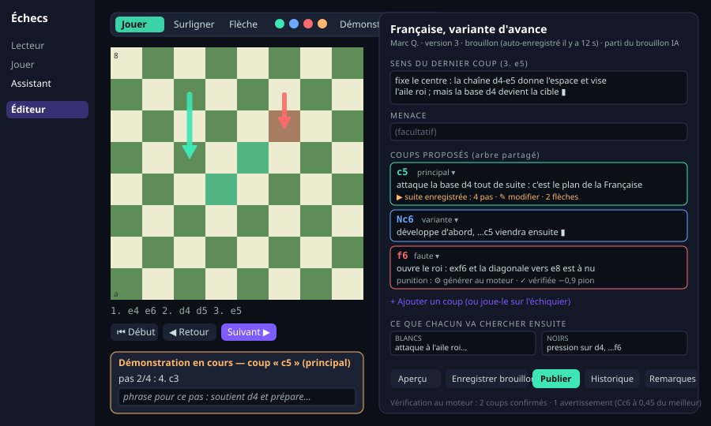
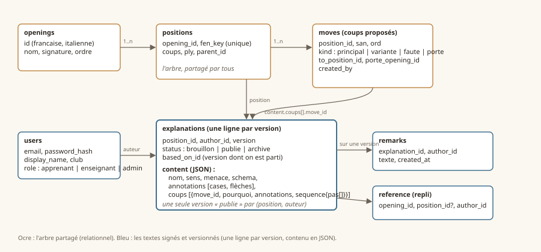

# Éditeur d'explications pour les enseignants — spécification

*Plateforme d'apprentissage des ouvertures, 9 octobre 2026. Document de travail : tout y est discutable.*

## 1. Le but en une phrase

Un enseignant, connecté avec son compte, se place sur une position d'une ouverture, et y écrit **son** explication :
le sens du dernier coup, la menace, les coups qu'il recommande ou déconseille avec leur pourquoi, en **montrant** ce
qu'il dit sur l'échiquier (cases surlignées, flèches) et en **enregistrant** des suites de coups que l'apprenant verra
se rejouer. Chaque sauvegarde est une version signée ; l'apprenant choisit le professeur qu'il lit.

## 2. Les objets

| Objet | Ce que c'est | Identité |
|---|---|---|
| **Livre** (ouverture) | Française, Italienne… avec ses premiers coups (signature) et ses portes vers d'autres livres | `francaise`, `italienne` |
| **Position** | un nœud de l'arbre d'un livre, atteint par une suite de coups | la **FEN normalisée** (pièces, trait, roques, prise en passant) + la ligne de coups canonique ; les interversions de coups retombent sur la même position |
| **Coup proposé** | une arête sortante d'une position : un coup, un type (**principal**, **variante**, **faute**, **porte** vers un autre livre), un ordre d'affichage | position + coup |
| **Explication** | le texte d'un auteur sur une position : nom de la variante, sens du dernier coup, menace, et pour chaque coup proposé son pourquoi ; plus les annotations et les séquences | auteur + position + numéro de version |
| **Annotation** | une case surlignée ou une flèche, avec une couleur, rattachée soit à la position (contexte), soit à un coup proposé (ce qu'il fait), soit à un pas d'une séquence | fait partie de l'explication |
| **Séquence rejouable** (démonstration) | une suite de coups à partir d'un coup proposé, avec une phrase facultative et des annotations à chaque demi-coup ; c'est ce que l'apprenant voit au survol (vite, muet) et au clic (pas à pas) ; pour une faute, c'est la punition | fait partie de l'explication, rattachée à un coup proposé |
| **Version** | chaque sauvegarde d'une explication est une version immuable ; une version est *brouillon*, *publiée* ou *archivée* ; une seule version publiée par auteur et par position | explication + numéro |
| **Remarque** | un commentaire d'un enseignant sur la version publiée d'un autre (« d'accord, mais j'ajouterais… ») | auteur + version visée |
| **Auteur** | un compte : apprenant, enseignant, administrateur ; plus un auteur système **« IA (brouillon) »** pour les textes générés | compte |

Règles :

- Une position appartient à un livre, mais la même FEN peut exister dans deux livres (après 1. e4, Française et
  Italienne la connaissent toutes deux) : la position est donc **(livre, FEN)**.
- Les coups proposés sont **partagés entre les auteurs** d'une position (c'est l'arbre du livre) ; chaque auteur écrit
  ses propres pourquoi dessus, et peut proposer d'ajouter un coup à l'arbre (ajout visible pour tous, à valider par un
  administrateur si l'on veut garder l'arbre propre : question ouverte 7.b).
- L'annotation et la séquence appartiennent à l'auteur : deux professeurs peuvent montrer la même variante avec des
  flèches différentes.
- Les textes existants (livre du 6 octobre, brouillons des 8 et 9 octobre) deviennent des explications de l'auteur
  « IA (brouillon) », que tout enseignant peut **reprendre** (copier dans son propre brouillon, avec la référence
  d'origine) pour corriger plutôt que partir d'une page blanche.

## 3. L'écran d'édition

Même mise en page que l'assistant que tu connais : l'échiquier à gauche, ancré ; le panneau à droite devient le
formulaire. Un enseignant connecté voit un bouton **« Modifier cette position »** sur l'assistant ; l'écran d'édition
s'ouvre sur la même position.



### 3.1 Navigation

- On arrive sur une position en jouant les coups sur l'échiquier, en cliquant dans la ligne des coups, ou par un lien :
  `editeur.html?livre=francaise&coups=e4 e6 d4 d5` (adresse partageable entre enseignants).
- Un fil d'Ariane montre la ligne ; les positions déjà expliquées par l'auteur sont marquées, celles qui n'ont qu'un
  brouillon IA aussi, celles qui n'ont rien du tout en rouge : l'enseignant voit où il manque du contenu.

### 3.2 Les modes de l'échiquier (barre d'outils au-dessus de l'échiquier)

| Mode | Geste | Effet |
|---|---|---|
| **Jouer** (par défaut) | déplacer une pièce | si le coup existe dans l'arbre : on navigue vers la position suivante ; sinon : proposition d'ajouter ce coup comme coup proposé (principal / variante / faute) |
| **Surligner** | clic sur une case ; clics successifs changent la couleur ; clic long efface | ajoute une case surlignée à l'élément sélectionné dans le panneau (position, coup proposé ou pas de séquence) |
| **Flèche** | glisser d'une case à une autre | ajoute une flèche de la couleur du type sélectionné : vert principal, bleu variante, rouge faute, orange libre ; glisser à nouveau la même flèche l'efface |
| **Démonstration** | bouton « Enregistrer une suite » sur un coup proposé ; puis on joue les coups sur l'échiquier | chaque demi-coup joué devient un pas ; un champ de phrase apparaît pour ce pas ; les surlignages et flèches posés pendant ce pas lui appartiennent ; boutons pas précédent / pas suivant / terminer ; la suite peut être vérifiée au moteur (voir 3.5) |

Les gestes reprennent ceux des études Lichess (clic droit = case, clic droit glissé = flèche) pour que les enseignants
qui les connaissent ne réapprennent rien ; les boutons de mode existent pour les autres et pour le tactile.

### 3.3 Le formulaire (panneau de droite)

Dans l'ordre, pour la position courante :

1. **Nom de la variante** (facultatif) et **auteur / version / état** affichés en permanence.
2. **Sens du dernier coup** : une à trois phrases. Annotations possibles (cases, flèches) rattachées à la position.
3. **Menace** (facultatif).
4. **Coups proposés** : la liste partagée de l'arbre, chaque ligne avec : le coup, son type (menu), le **pourquoi** de
   l'auteur, ses annotations, et sa **séquence rejouable** (bouton « Enregistrer une suite » / « Modifier la suite »,
   avec le nombre de pas et l'état « vérifiée au moteur : −0,9 pion » pour une faute). Glisser pour réordonner.
   Bouton « Ajouter un coup » (ou jouer le coup sur l'échiquier en mode Jouer).
5. **Fautes typiques** : même liste, filtrée sur le type faute, pour les voir ensemble.
6. **Ce que chacun va chercher ensuite** (schéma de milieu de jeu) : deux champs, Blancs et Noirs, facultatifs.
7. **Boutons** : **Aperçu** (la position s'affiche exactement comme l'apprenant la verra, avec le survol et le pas à
   pas), **Enregistrer le brouillon**, **Publier**, **Historique** (liste des versions, comparaison côte à côte, restaurer),
   **Partir du texte de…** (reprendre la version d'un autre auteur ou le brouillon IA), **Remarques** (lire et écrire des
   remarques sur les versions des autres).

Sauvegarde automatique du brouillon toutes les trente secondes et à chaque changement de position ; on ne perd rien
en naviguant.

### 3.4 Ce que voit l'apprenant

Inchangé par rapport à l'assistant actuel, plus : un **sélecteur de professeur** (en haut, déjà prévu) ; par défaut le
professeur de son club ou de son choix, mémorisé ; si ce professeur n'a rien publié sur une position, on le dit et on
affiche le texte de repli (un autre professeur désigné « référence » par l'administrateur, sinon le brouillon IA, marqué
comme tel). Les séquences rejouables de l'auteur affiché remplacent les punitions calculées.

### 3.5 Vérifications à la sauvegarde (non bloquantes, affichées comme avertissements)

- Tous les coups (proposés, séquences) sont **légaux** depuis leur position ; sinon blocage, c'est une erreur de saisie.
- Un coup marqué **faute** est passé au moteur : s'il n'est pas nettement inférieur (moins de 0,3 pion de perte), on
  prévient : « le moteur ne voit pas de faute ici ». Un coup **principal** nettement inférieur au meilleur : même
  avertissement inversé. L'enseignant garde le dernier mot.
- Une **séquence de punition** peut être générée par le moteur d'un clic (ce que fait déjà le script actuel), puis
  modifiée ou commentée par l'enseignant.
- Les flèches posées sur un coup proposé qui ne correspondent à aucun déplacement légal sont signalées.

## 4. Le modèle de données

Choix : **une explication = une ligne par version**, avec les champs indexables en colonnes (position, auteur, version,
état, dates) et le **contenu en JSON** (sens, menace, coups avec leurs pourquoi, annotations, séquences). Pourquoi : une
explication se lit, s'édite et se versionne toujours d'un bloc ; la découper en dix tables n'apporte que des jointures.
L'arbre (positions et coups proposés), lui, est relationnel parce qu'il est partagé et parcouru.



```sql
-- comptes (existe déjà)
users(id, email, password_hash, display_name, role: apprenant|enseignant|admin, club, created_at)

-- l'arbre partagé
openings(id text pk, nom, signature, ordre)                      -- 'francaise', 'italienne'
positions(id, opening_id, fen_key unique avec opening_id, coups, ply, parent_id)
moves(id, position_id, san, kind: principal|variante|faute|porte, ord,
      to_position_id null, porte_opening_id null, created_by, created_at)

-- les textes, une ligne par version
explanations(id, position_id, author_id, version int, status: brouillon|publie|archive,
             based_on_id null,          -- version d'un autre auteur dont on est parti
             content jsonb,             -- voir ci-dessous
             engine_check jsonb null,   -- résultat des vérifications 3.5
             created_at, published_at null)
  contrainte : une seule ligne 'publie' par (position_id, author_id)

remarks(id, explanation_id, author_id, texte, created_at)        -- remarques sur la version d'un autre
reference(opening_id, position_id null, author_id)               -- auteur de référence (repli), par livre ou par position
```

Forme de `content` :

```json
{
  "nom": "Française, variante d'avance",
  "sens": "fixe le centre : la chaîne d4-e5 donne l'espace…",
  "menace": null,
  "annotations": [ { "type": "case", "case": "d4", "couleur": "vert" },
                   { "type": "fleche", "de": "e5", "a": "f6", "couleur": "orange" } ],
  "coups": [
    { "move_id": 123, "pourquoi": "le levier contre la base de la chaîne…",
      "annotations": [ { "type": "fleche", "de": "c7", "a": "c5", "couleur": "vert" } ],
      "sequence": { "pas": [ { "san": "c5", "phrase": "attaque d4 tout de suite", "annotations": [] },
                             { "san": "c3", "phrase": "soutient d4" } ] } }
  ],
  "schema": { "blancs": "…", "noirs": "…" }
}
```

Migration des livres actuels : un script lit `livres/francaise.js` et `livres/italienne.js`, crée les positions et les
coups proposés, et une explication publiée de l'auteur « IA (brouillon) » par position, avec les punitions calculées
comme séquences. Les fichiers statiques restent générés depuis la base (export) tant que la page de l'assistant lit des
fichiers ; à terme elle lit l'API.

## 5. L'API (serveur Node existant, sessions par cookie)

| Méthode et chemin | Rôle | Qui |
|---|---|---|
| `POST /api/auth/connexion`, `/deconnexion`, `GET /api/auth/moi` | session | tous |
| `GET /api/livres` | les livres, leur signature, leurs auteurs publiés | tous |
| `GET /api/positions?livre=&coups=` | la position, l'arbre sortant, les explications publiées (par auteur) ou la mienne en brouillon | tous (brouillons : l'auteur) |
| `POST /api/positions/:id/coups` | proposer un coup à l'arbre | enseignant |
| `PUT /api/explications/:position/moi` | enregistrer mon brouillon (crée une version) | enseignant |
| `POST /api/explications/:id/publier` | publier (archive ma version publiée précédente) | enseignant (la sienne) |
| `GET /api/explications/:position/historique` | mes versions, et les versions publiées des autres | enseignant |
| `POST /api/explications/:id/reprendre` | partir du texte d'un autre | enseignant |
| `POST /api/explications/:id/remarques` | remarque sur une version | enseignant |
| `POST /api/verifier` | vérifications moteur d'un brouillon (3.5) | enseignant |
| `POST /api/admin/invitations`, `/reference` | inviter un enseignant, désigner une référence | admin |

Comptes : création par invitation de l'administrateur au départ (un lien par courriel) ; inscription libre des
apprenants plus tard si tu le veux. Mots de passe hachés (argon2), sessions en base, cookies `HttpOnly` et `Secure`.

## 6. Rôles

| | apprenant | enseignant | admin |
|---|---|---|---|
| lire les versions publiées, choisir son professeur | oui | oui | oui |
| écrire, publier **ses** explications, remarques sur les autres | | oui | oui |
| proposer un coup à l'arbre | | oui | oui |
| valider un coup proposé à l'arbre, inviter, désigner une référence, archiver un texte | | | oui |

## 7. Questions à trancher

a. **Un professeur à la fois, ou comparaison** : l'apprenant lit un seul professeur (simple) ou peut mettre deux
   versions côte à côte sur la même position (plus riche, écran plus chargé) ?
b. **L'arbre partagé** : un enseignant ajoute-t-il librement un coup à l'arbre, ou l'administrateur valide-t-il ?
   (Je recommande : ajout libre en type « variante », validation seulement pour changer le coup principal.)
c. **Publication** : libre pour tout enseignant invité, ou relue par l'administrateur ? (Je recommande : libre, avec
   archivage possible par l'administrateur.)
d. **Les brouillons IA** : visibles aux apprenants quand aucun professeur n'a écrit (marqués comme tels), ou réservés
   aux enseignants comme matière première ?
e. **Licence des textes** : pour une plateforme ouverte, il faut la fixer dès le premier texte publié. Je recommande
   CC BY-SA (attribution, partage dans les mêmes conditions), à accepter à l'inscription des enseignants.
f. **Vidéo** : hors de ce lot ; prévoir seulement un champ « lien vidéo » par explication pour ne pas se fermer la porte.

## 8. Étapes de réalisation

| Étape | Contenu | Durée estimée |
|---|---|---|
| 1 | Schéma complet (§4), migration des deux livres en base, export des fichiers statiques depuis la base | 1 jour |
| 2 | Comptes : invitation, connexion, sessions, rôles ; page de connexion | 1 jour |
| 3 | API de lecture ; l'assistant lit l'API (sélecteur de professeur réel, repli) | 1 jour |
| 4 | Éditeur : formulaire, modes de l'échiquier (cases, flèches), coups proposés, aperçu, brouillon et publication | 3 jours |
| 5 | Séquences rejouables : enregistrement pas à pas avec phrases, génération moteur d'une punition, lecture côté apprenant | 2 jours |
| 6 | Versions : historique, comparaison, reprendre le texte d'un autre, remarques ; référence et repli | 2 jours |
| 7 | Vérifications moteur à la sauvegarde ; téléphone (lecture seule) ; premier enseignant invité | 1 jour |

Soit une dizaine de jours de travail pour une première version complète, utilisable par un vrai professeur. Les étapes
1 à 3 ne changent rien pour l'apprenant ; dès l'étape 4 tu peux écrire toi-même, comme premier enseignant.
